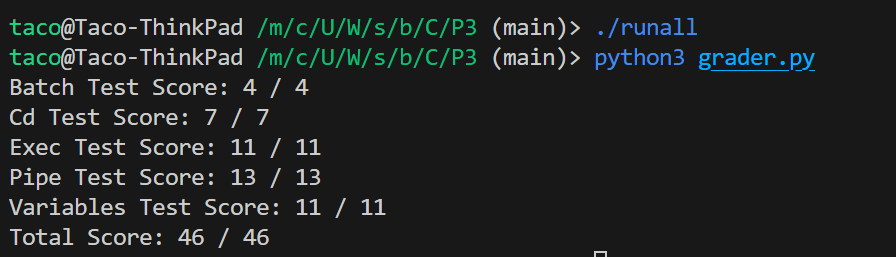

# CS537-OS-LocalGrader

Just clone things from the linux machine that can run on your machine. (But why I need this?)

Use some unix-style machine like WSL on Windows.

# Generic Grading

```
pregrade P{num}
```

num is the Project number.

e.g.

```
./pregrade P1
```

# P0

XD

# P1

Copy your `MADCounter.c` to the P1 directory. And run the following command in that directory.

```
./test-madcounter.csh
```

If you want to see all the test points, use `-c`

```
./test-madcounter.csh -c
```

To see complete output (and log to file).

```
./test-madcounter.csh -c -vv > log.txt
```

# P2

Copy the *xv6-public* folder to P2

Then go to your folder and execute the tests

```
cd P2/xv6-public
```

```
../tester/runtests -d ../initial-xv6/tests/ -c 
```

You may need to create a new directory called `test-out` in public-xv6 dir. If you encounter problems.

**Note: There are problems with test8. The user program is not included in the Makefile. I tried to include but it's too large for the xv6 system.**

-> I asked TA. The old version does have this problem. Then they reduce it from 12 to 8 tests. You may try to add `test_8.c(_test_8)` to your makefile and manually test it. I won't update this because this contains more test points and it's easy to test by yourself.

# P3

This is easy. Just go through the intructions and mark all the test points. A little bit complex.

For me, go through the *.run* and *.out* is enough to pass the rest of this assignments.

Copy your wsh.c  to P3 folder and execute the followings:

```
./test-cd.csh
./test-exec.csh
./test-variables.csh
./test-history.csh
./test-pipe.csh
./test-batch.csh
```

There's no runtests until 2024/2/27. So I made a simple grader.



First, `./runall` to run all the tests and log the grade to `test_results.txt`, then use the `grader.py` to see general scores.

# P4

copy your xv6-public to P4 dir.

Then open terminal in xv6-public. Then execute

```
../runtests ../ -c
```

../runtests is the script in the P4 dir.

../ is where the tests locates.

-c is to run all ignore fail.

***For some reason, when it execute fail, the test still pass. 2024.3.7***


# P5

I didn't do that. Only a copy of it.


# P6

I decided not to modify the `runtests` . It just run a python.


Copy your code or folder anywhere, in that folder, run

```
$path_to_P6tester/tester.py
```

e.g.

```
taco@machine:/xxx/CS537-OS-LocalGrader/P6_code$ ../P6/runtests
```
